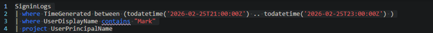
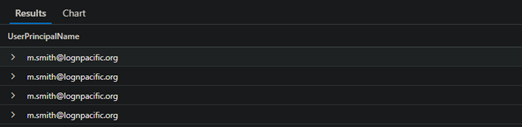

Threat Hunt Report: Scattered Spider
Business Email Compromise Investigation
---
Trigger
LogN Pacific Financial Services received an urgent call from their bank's fraud department. A vendor payment of £24,500 was redirected to an unknown account. The receiving bank flagged the transaction as suspicious and froze the funds. The finance team insists they followed standard procedures.
---
Initial Report
Finance employee Mark Smith reported "weird MFA notifications" on the evening of 25 February. He was at home watching TV and kept getting prompted to approve a sign-in. He assumed it was an IT glitch and eventually approved one to make them stop. The next morning, colleagues discovered inbox rules nobody created.
---
Objective
Confirm the compromise. Identify the attacker's infrastructure. Scope the damage. Determine what inbox rules were created, what emails were sent, and what data was accessed. Identify the threat actor.
---
IR Lead // Opening Brief
> "We have a confirmed fraudulent wire transfer. £24,500 redirected to an unknown account. The bank caught it and froze the funds. Finance say they followed procedure ... they got an email from a known colleague with updated banking details and processed it."
> "That colleague is Mark Smith. Mark reported weird MFA notifications last night. He approved one just to make it stop. This morning his team found inbox rules nobody created. I need you in the sign-in logs now. Confirm the compromise, identify the attacker's infrastructure, and tell me how they got past MFA. Clock is running."
---
Flags
---
Flag 1 – Compromised Account
Objective: Before you can investigate, confirm the compromised identity.
By querying the SignInLogs within the attack time frame, the victim user was identified as Mark Smith.
Query Used:

Result:

---
Flag 2 – Attacker Source IP
Objective: Locate the attacker's source IP.
To find Mark's legitimate IP, sign-in data prior to the attack window was queried and compared against the IP address recorded at the start of the attack.
Query Used:

Result:

---
Flag 3 – Attack Origin Country
Objective: Locate the attacker's origin country using the IP address.
iplookup.org was used to retrieve geolocation data for the attacker's IP address, confirming the origin as the Netherlands.
Result:

---
Flag 4 – MFA Denial Error Code
Objective: What error code shows that MFA was required but not completed?
SignInLogs were queried within the attack window and filtered for failed authentication attempts. The result returned the error code indicating MFA was required but not completed.
Query Used:

Result:

---
Flag 5 – MFA Fatigue Intensity
Objective: How many MFA push requests came through before Mark accepted one?
SignInLogs were filtered within the attack window and ResultSignatures sorted by time. This confirmed that Mark received 3 MFA push requests before accepting one, consistent with an MFA fatigue (push bombing) attack.
Query Used:

Result:

---
Flag 6 – Application Accessed
Objective: After initial access, the attacker accessed a specific application – which one?
SignInLogs were sorted from the exact time of the attacker's successful authentication. The attacker first accessed Outlook on the Web.
Query Used:

Result:

---
Flag 7 & 8 – Attacker OS and Browser
Objective: Find the attacker's OS and browser.
The DeviceDetail field within SignInLogs was examined, revealing the attacker's operating system and browser information.
Query Used:

Result:

---
Flag 9 & 10 – First Post-Auth Action and Rule Creation
Objective: What was the first thing the attacker did after successfully accessing the account?
The CloudAppEvents table provides telemetry for Office 365 and other cloud services. Querying this table revealed that the attacker first accessed Mark's mail items in Microsoft Exchange. Evidence of inbox rule creation was also identified.
Query Used:

Result:

---
Flag 11–14 – Forward Rule Name and Details
Objective: Find the name of the rule created by the attacker and its details.
Parsing the RawEventData field in CloudAppEvents revealed how the attacker attempted to conceal their activity. The name field was left blank. The rule forwards any emails containing specific financial keywords to an external address: `insights@duck.com`. StopProcessingRules was set to `True` to prevent further rule evaluation and reduce detection.
Query Used:

Result:

---
Flag 15 & 16 – Delete Rule Name and Keywords
Objective: Was a rule created to delete messages and conceal the attack?
A second rule named `..` was identified. This rule automatically deleted inbound messages containing keywords associated with security alerts and suspicious activity notifications.
Query Used:

Result:

---
Flag 17–20 – BEC Attack
Objective: Search EmailEvents to find who received the fraudulent email.
Querying EmailEvents using Mark Smith's display name returned the full attack chain. The recipient of the fraudulent email was `j.reynolds@lognpacific.org`. The attacker used thread hijacking to increase the email's apparent legitimacy. The subject line was: `RE: Invoice #INV-2026-0892 - Updated Banking Details`.
Query Used:

Result:

---
Flag 21 – Cloud App Accessed
Objective: What else did the attacker access, if anything?
CloudAppEvents confirmed the attacker also accessed Mark Smith's Microsoft OneDrive during the same session.
Query Used:

Result:

---
Flag 22 – SharePoint App Accessed
Objective: What was the other cloud app the attacker accessed?
Further querying of CloudAppEvents identified Microsoft SharePoint as an additional cloud application accessed by the attacker.
Query Used:

Result:

---
Flag 23 – Session Correlation
Objective: Check the CloudAppEvents inbox rule events. In RawEventData, find `AppAccessContext.AADSessionId`. Then confirm it matches the `SessionId` in SigninLogs for the attacker's successful authentication.
The `AADSessionId` value extracted from RawEventData in CloudAppEvents was matched against the `SessionId` field in SignInLogs, confirming a single continuous attacker session from authentication through to post-compromise activity.
Query Used:

Result:

---
Flag 24 – Conditional Access Status
Objective: Conditional Access policies can block sign-ins from unmanaged devices or risky locations. Check the attacker's successful sign-in. What was the `ConditionalAccessStatus`?
Filtering SignInLogs from the start of the attack and reviewing the `ConditionalAccessStatus` field confirmed that no Conditional Access policy was applied to the attacker's sign-in.
Query Used:

Result:

---
Flag 25 & 26 – MITRE Mapping
Objective: Map the attack methods to the MITRE ATT&CK framework.
MFA fatigue maps to T1621 because attackers spam MFA prompts to pressure users into approving access. Email rule creation maps to T1114.003 when used to forward and exfiltrate emails, or T1564.008 when used to hide alerts and conceal malicious activity. The mapping depends on whether the goal of the rule is data collection or evasion.
Technique	ID	Description
Multi-Factor Authentication Request Generation	T1621	MFA push bombing to pressure victim approval
Email Collection: Email Forwarding Rule	T1114.003	Silent forwarding of financial emails to external address
Hide Artifacts: Email Hiding Rules	T1564.008	Deletion rule to suppress security alert notifications
---
Flag 27 – Credential Source
Objective: The threat group behind this attack is known for purchasing credentials from a specific source. What type of malware typically provides initial credentials to groups like this?
The type of malware that typically provides these stolen credentials is infostealer malware. Infostealers are designed to harvest saved passwords, browser cookies, session tokens, autofill data, and other sensitive information from infected systems. Threat actors then sell this data on underground markets for use in follow-on attacks. Common examples include families such as RedLine, Raccoon, and Lumma.
---
Flag 28 – Immediate Containment
Objective: What is the first remediation action?
The first action is to disable Mark Smith's account and force a password reset.
---
Flag 29 – Threat Actor Attribution
Objective: Throughout this investigation you observed MFA fatigue, inbox rule persistence, BEC targeting finance, and use of anonymising infrastructure. The briefing mentioned a group that targeted MGM Resorts and Caesars Entertainment. Who did this?
Scattered Spider.
---
Cyber Range // Hunt 02 — SCATTERED INVOICE // IR-2026-0225-BEC
